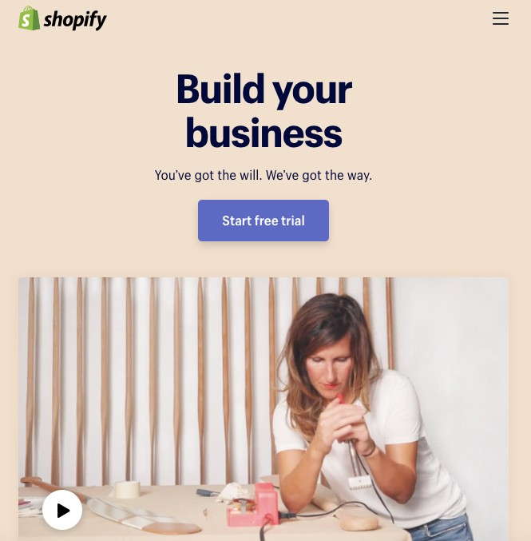
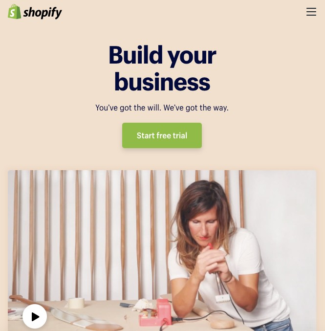

```{r setup, include=FALSE}
knitr::opts_chunk$set(echo = TRUE)
```

## A/B Testing: Experimental Design
March 26, 2019

## What is A/B Testing?
A/B testing is a framework for you to test different ideas for how to improve upon an existing design. 

For marketing, this often means testing:

- Promotional offers: The amount, type of offer, topics etc.
- Copy: Positioning, types of words 
- Form fields: Display more or less 
- Page layout: Location of items of a page,
- Conversion rates: Website, placement of CTAs, colours, text
- Drop off rates: how many pages an individual views before they leave a site
- Time spent on a website: how long did they spend on a website
- Email subject lines: what subject line makes people open it

## A/B Testing Process


A/b testing is not just something you do once, You want to be constantly updating your website/app/email/ad to maximize for:
- Conversions
- Usage rates
You are always making minor updates to push those numbers upwards

To design an effective A/B test, you need:
* A control option
* A test option

<small>Image Source: [Optimizely: Optimization Glossary](https://www.optimizely.com/optimization-glossary/ab-testing/)</small>

## Find an Example
Have students find an eaxmple online of A/B testing in practice. What did the organization test? What were their resutls? Share the answers in Slack.

## Example
<small>All examples are fictious.</small>

Lets say that we are interested in knowing if <b>Build your business</b> performs better than <b>Create your business</b> in terms of how long users stay on the homepage.



## Variables

> - <b>Question</b>: How long are users staying on our homepage?
> - <b>Hypothesis</b>: Users stay on the site longer when they see <b>Build your business</b>. 
> - <b>Dependent Variable</b>: Time on site.
> - <b>Independent Variable</b>: The condition of Build versus Create.

## Common Statistical Tests for A/B Testing

<b>T-test</b>: Allows us to compare two groups with a continuous dependent variable.

An example for when you would use a t-test to evaluate an A/B test would be to measure, for instance, time (how long are individuals staying on my website) as the dependent variable.

<b>Logistic Regression</b>: Allows us to compare two groups with binary (categorical) dependent variable. 

An example for when you would use logistic regression to evaluate an A/B test, might be for conversions (did the user complete the action or not).

## Running a t-test
To get the dataset, visit Blackboard and download the 'time.csv' file.

```{r condition, message=FALSE, warning=FALSE}
create_build_eval <- read.csv("time.csv")
head(create_build_eval)
```
## Running a t-test

```{r message=FALSE, warning=FALSE}
experiment_results <- t.test(time_spent_homepage_sec ~ condition, data = create_build_eval)
experiment_results
```

When creating our t.test, dependent variable ~ independent variable. 
In the results, look at the p-value and the means (means are fairly similar) meaning no significant reults.

## Example - Test Version
<small>All examples are fictious.</small>



## Variables

- <b>Question</b>: Will making a colour change to my button result in more button clicks?
- <b>Hypothesis</b>: By changing the colour to 'green' it will result in more button clicks. 
- <b>Dependent Variable</b>: Whether or not the user clicked the button.
- <b>Independent Variable</b>: Button colour.

From these variables we can already see the shape that our experiment is being to take.

Before we start building our experiment, we need to ensure we gather preliminary data. What does our conversion rate look like before the change? We need o do this to establish aseline data. 

## Evaluate Preliminary Dataset

```{r clicks, message=FALSE, warning=FALSE}
library(tidyverse)

clicks <- read.csv("click.csv")
clicks
```

## Calculate Conversion Rate
Calculate the conversion rate by using the 'dplyr' function <b>summarize</b> to find the means of the clicks over all time.
```{r}
library(dplyr)
clicks <- read.csv("click.csv")

clicks %>%
  summarize(conversion_rate = mean(clicked_button))
```
If we look at the results, we see a conversion rate of, on average, 27% or roughly 27/100 visitors convert.

## Factors
We computed the rate over the year, but there could be other factors that affect the number of clicks. We'll compute the conversion rate of clicks by month to see if there is a change month to month. 

```{r message=FALSE, warning=FALSE}
library(lubridate)

clicks %>%
  group_by(month(visit_date)) %>%
  summarize(conversion_rate = mean(clicked_button))
```

## Plot the Results
```{r message=FALSE, warning=FALSE}
library(ggplot2)

clicks_sum <- clicks %>%
  group_by(month(visit_date)) %>%
  summarize(conversion_rate = mean(clicked_button))

clicks_sum_plot <- ggplot(clicks_sum, aes(x = `month(visit_date)`, y = conversion_rate)) + 
  geom_point() + 
  geom_line()
```

## View Plot

```{r echo=FALSE, fig.height=5}
plot(clicks_sum_plot)
```
We are able to see that there is significant difference month-to-month in terms of the number of conversions.


## Load Experiment File

```{r message=FALSE, warning=FALSE}
library(tidyverse)

experiment_data <- read_csv("experiment.csv")
experiment_data
```

## Experiment Results

```{r message=FALSE, warning=FALSE}

experiment_data_sum <- experiment_data %>%
  group_by(visit_date, condition) %>% 
  summarize(conversion_rate = mean(clicked_button))

experiment_data_sum
```

## Plot Experiment Results

```{r message=FALSE, warning=FALSE}
experiment_data_plot <- ggplot(experiment_data_sum, 
       aes(x = visit_date, y = conversion_rate, 
           color = condition, 
           group = condition)) +
  geom_point() +
  geom_line()
```

## View Plot 
```{r echo=FALSE}
plot(experiment_data_plot)
```

## Analyze our Experiment Results
We decided to analyze our results using logistic regression
Glm function

Looking at the estimate column for the row, we can see that the test condition had a higher conversion rate. The model estimate is positive.


```{r message=FALSE, warning=FALSE}
library(tidyverse)
library(broom)

experiment_data <- read_csv("experiment.csv")

glm(clicked_button ~ condition, 
    family = "binomial", 
    data = experiment_data) %>%
  tidy()
```

## Let's Try It!
In this example, we want to know if by moving our <b>Like</b> button on a page, if it will result in more clicks on the button.

## Answer
```{r like, message=FALSE, warning=FALSE}
library(tidyverse)
## Load File
like_data <- read_csv("like.csv")

## Evaluate Conversions
like_data_sum <- like_data %>%
  group_by(visit_date, condition) %>% 
  summarize(conversion_rate = mean(clicked_like))

## Plot Data
ggplot(like_data_sum, 
       aes(x = visit_date, y = conversion_rate, 
           color = condition, 
           group = condition)) +
  geom_point() +
  geom_line()

## Analyze Experiment
library(tidyverse)
library(broom)

glm(clicked_like ~ condition, 
    family = "binomial", 
    data = like_data) %>%
  tidy()
```

## Power Analysis
A/B testing tries to run both conditions simultaneously as opposed to separately so that both are exposed to the same variables. 

Experiment length is one of the big question in A/B testing. If you stop too soon, you may not see an effect. If you wait too long, you may waste valuable resources on a failed experiment.

A power analysis will tell you how many data points (or sample size) you’ll need to ensure the effect is real.

There are lots of sample size calculators online. For example, [SurveyMonkey](https://www.surveymonkey.com/mp/sample-size-calculator/) has an online calculator that lets you calculate sample size.

> - <b>Statistical Test</b>: Test you plan to run
> - <b>Baseline Value</b>: Value for the current condition
> - <b>Desired Value</b>: Expected value for the test condition
> - <b>B</b>: Proportion of the data (ideally 0.5)
> - <b>Alpha</b>: Level where effect is significant (generally 0.05)
> - <b>Power</b>: Probability of rejecting the null hypothesis (generally 0.8)

## Running a Power Analysis

Power or 1 -beta: probability of rejecting the null hypothesis and is the basis for estimating sample size

Power is often closely tied to the significance level or alpha, also referred to as the p-value. Alpha is usually 0.05.

Effect size: magnitude of the effect. To compute take the difference between the two groups and divide by the standard deviation of the two groups. 

As power goes up, so does the number of data points needed. 

Run a logistic regression (because of binary data) 
Choose dataset for variable P1 and have it match the conversion rate (January - 20%)

P2 is normally backed by previous data. Since we only have a year’s worth of data to work with, let’s take an educated guess at the result. 

```{r message=FALSE, warning=FALSE}
library(powerMediation)

total_sample_size <- SSizeLogisticBin(p1 = 0.2,
                                      p2 = 0.3,
                                      B = 0.5,
                                      alpha = 0.05,
                                      power= 0.8)

total_sample_size
```

## What do I do if my results are not significant?
<b>Stopping rules</b> procedure that allows for interim analysis at predefined times. Because of te predefined stop-times, this has to be built into your experiment plan.

> Stopping rules are also known as <b>Sequential Analysis</b>

Once you hit the predefined stop-times, there are three choices you can make. You can:

> - Stop the experiment because you have statistical signicance
> - Stop the experiment because it didn't work
> - Continue the experiment because not enough data has been collected

## Sequential Analysis

```{r message=FALSE, warning=FALSE}
library(gsDesign)

seq_analysis <- gsDesign(k = 4, 
                         test.type = 1, 
                         alpha = 0.05, 
                         beta = 0.2, 
                         sfu = "Pocock")

seq_analysis
```

## Sample Size for Sequential Analysis

<b>Resource-based</b>: figure out the maximum number of data points we are willing to collect.

```{r message=FALSE, warning=FALSE}
library(gsDesign)

seq_analysis <- gsDesign(k = 4, 
                         test.type = 1, 
                         alpha = 0.05, 
                         beta = 0.2, 
                         sfu = "Pocock")

max_n <- 1000
max_n_per_group <- max_n / 2

stopping_points <- max_n_per_group * seq_analysis$timing

stopping_points
```

## A/B Testing Vs. Multivariate Testing

Sometimes, the goal of an experiment is to see whether or not two different independent variables affect one another. 


Rather than running two separate A/B tests, we could analyze the performance through multivariate testing (which tests to see if there is an interaction effect between the variables).

## Assignment 5: Creating our own Experiment {.title}
<b>Due date: Tuesday, April 9, 2019</b>

For this assignment, you will be working in pairs. You can choose your partner. 

In your team, you will form a hypothesis about an email campaign for one of your favorite new or existing products. For example, a hypothesis might be: “An email campaign for a company that sells outdoor gear will convert (i.e., cause a customer to finalize a purchase) more with a subject line with a promotional message plus call to action (e.g., ‘50% Off All Jackets. Buy Now!’) than one with a promotional message alone (e.g., ‘50% Off All Jackets.’).

Using [Mailchimp](https://mailchimp.com/), you will determine what you would like to test (i.e. subject line, call to action etc.) and create your three emails. Each member of the team will take a different stance (i.e.”Version A will outperform Version B”) on the hypothesis. 

## Assignment 5: Setting up your Campaign
<b>Due date: Tuesday, April 9, 2019</b>

A couple of items to set up your campaign:

- Your population size is 50 - you must find at least 50 people to receive your email and yes you can use your classmates and myself.
- You must have a sample size of 39 (at least 39 people will have had to open the email) of your original population.
- In order to be CASL compliant, you must provide an opt-in mechanism to your subscribers (i.e. you can’t subscribe people to your email list - they must elect to join). MailChimp has this function available. 

<b>Helpful hint: Only register for ONE MailChimp Account per team.</b>

You will be required to submit a report <b>(each)</b> on the performance of your hypothesis. The outline for what needs to be in your report is on Blackboard. 

Also include all of your data and your work to determine whose results were successful. 

Helpful reading for running an A/B test with MailChimp: [https://mailchimp.com/help/create-an-ab-testing-campaign/](https://mailchimp.com/help/create-an-ab-testing-campaign/)


